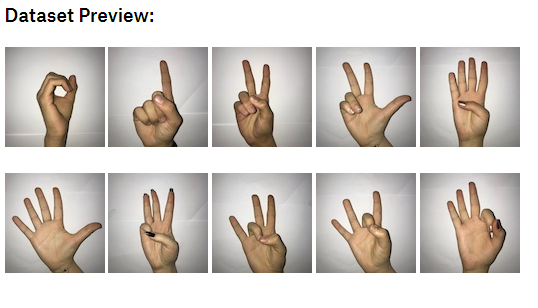
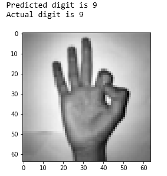
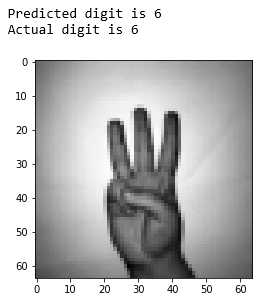
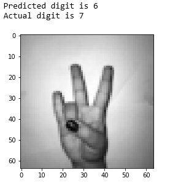
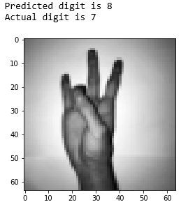
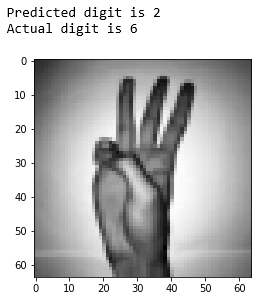

# Sign-Language-Digits

This is a Deep Learning model based on the Kaggle competition "Sign Langauge Digits". The 
dataset can be downloaded in the following link.
https://www.kaggle.com/ardamavi/sign-language-digits-dataset

 

Each sign in the above image is a label consecutively from 0 to 9. 

The goal is to learn a model which can detect the digit between 0 and 9, given a grayscale image of size (64,64)
I have used a convnet using the Keras Sequential API.
The model uses a relatively small dataset comprising of 2000 images across all the 10 categories.
Some of the correctly predicted images are shown below.

  

However, the model doesn't seem to recognize the digits 7,8 and 9 properly.
Here are some of the misclassified digits.
   
